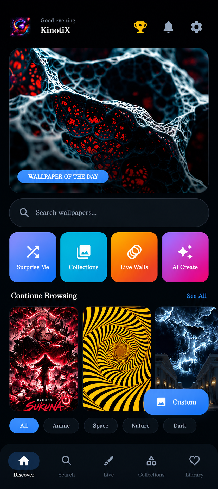
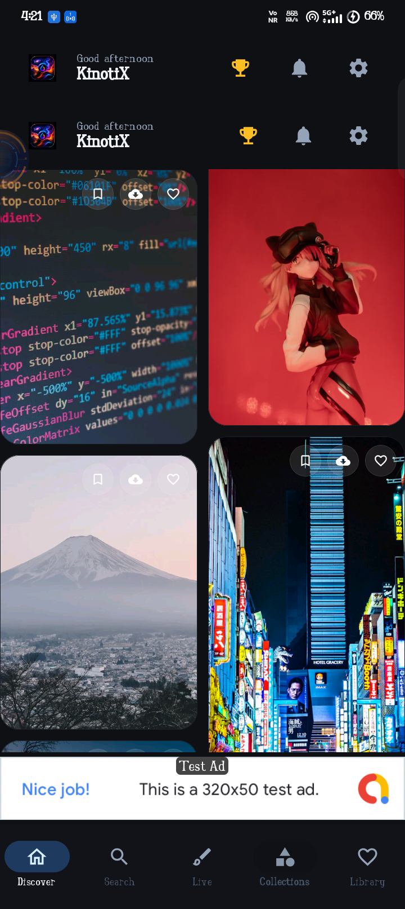
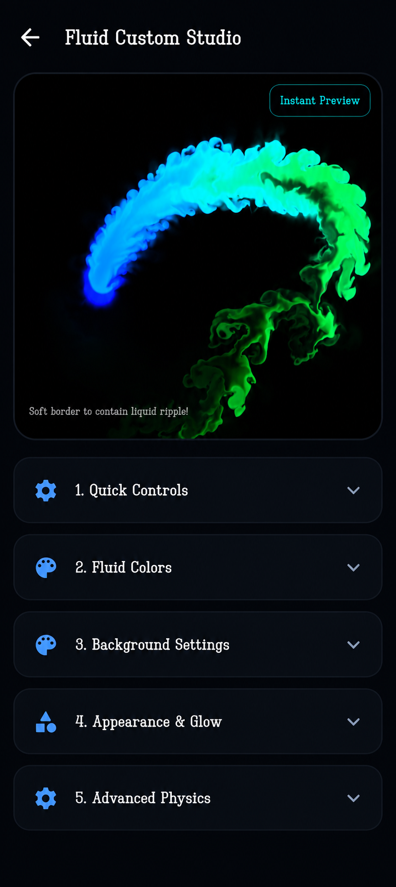
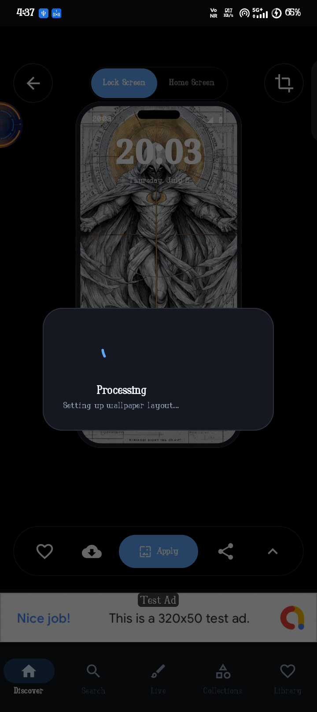

<div align="center">

# 🌌 KinotiX — Next-Gen Android Wallpaper Engine

[](https://play.google.com/store/apps/details?id=com.kinotix.app)
[](https://github.com/Tcode-Motion/kinotix)
[](https://github.com/Tcode-Motion/kinotix/releases)
[](https://developer.android.com)
[](https://kotlinlang.org)
[](LICENSE)

**KinotiX** is a flagship open-source Android application designed for ultra-high-definition visual experiences. Featuring 3D Parallax Gyroscope live wallpapers, interactive C++/OpenGL ES fluid dynamics simulations, high-bitrate video loops, transparent live camera backgrounds, and a smart 6-signal AI recommendation engine.

[🌐 Official Website](https://tcode-motion.github.io/kinotix/) • [📱 Google Play Store](https://play.google.com/store/apps/details?id=com.kinotix.app) • [📖 Documentation](https://tcode-motion.github.io/kinotix/features.html) • [❓ FAQ](https://tcode-motion.github.io/kinotix/faq.html)

---

### 📱 Live Device Preview
<p align="center">
  
  
  
  
</p>

</div>

---

## 🔥 Key Technical Highlights

### 1. 🌀 4 Native Live Wallpaper Engines
- **3D Parallax Gyro Engine** (`LiveWallpaperService.kt`): Multi-layer depth rendering powered by Android hardware rotation sensors.
- **OpenGL ES Fluid Engine** (`FluidWallpaperService.kt`): Real-time C++ Navier-Stokes fluid velocity and particle dynamics simulation.
- **Video Loop MP4 Engine** (`VideoWallpaperService.kt`): High-bitrate video streaming backed by a 32KB buffer disk cache.
- **Live Camera Transparent Background** (`CameraWallpaperService.kt`): Real-time camera preview background via `FOREGROUND_SERVICE_CAMERA`.

### 2. 🧠 Smart 6-Signal AI Recommendation Engine
Personalizes every feed using a 6-tier weighted scoring matrix:
1. **Favorites Signal (w=3.0)**: Matches user's bookmarked artwork tags and styles.
2. **Search History Signal (w=2.5)**: Evaluates frequency-weighted keyword queries.
3. **Download & Apply Signal (w=2.0)**: Extracts metadata from wallpapers saved to gallery.
4. **Recently Viewed Signal (w=2.0)**: Tracks Room DB history.
5. **Onboarding Preference Signal (w=1.5)**: Dynamic category choices from first launch.
6. **Popularity & Recency Signal (w=1.0)**: Normalized engagement scores.

### 3. ⚡ Fast 2ms WebP & Deduplication Pipeline
- **2ms WebP Caching**: Converts high-res raw images into lightweight 20KB WebP thumbnails via `wsrv.nl` CDN, backed by Coil 3 1GB disk cache and 45% RAM memory pool.
- **0.001ms $O(1)$ DeduplicationEngine**: Fingerprints CDN photo IDs, file paths, and image dimensions to eliminate duplicate visual cards.
- **Automatic 404 Interception**: Instantly replaces failed network image URLs with verified HTTP 200 OK fallback wallpapers in 0ms.

---

## 🛠️ Tech Stack & Architecture

| Layer | Technology / Library |
| ----- | ------------------- |
| **Architecture** | Clean Architecture + MVVM + Repository Pattern |
| **UI Framework** | 100% Jetpack Compose + Material 3 |
| **Language** | Kotlin 2.0.0 |
| **Database** | Room DB 2.6+ with FTS4 Full-Text Search |
| **Image Pipeline** | Coil 3 + OkHttp 4 + WebP Transformation |
| **Pagination** | Jetpack Paging 3 (Infinite Scrolling) |
| **Live Engines** | OpenGL ES 2.0/3.0 + Android Camera2 + SensorManager |
| **Dependency Injection** | Android ViewModelScope + Coroutines Flow |
| **Build Tooling** | Gradle 8.7 + KSP + CMake C++ NDK |

---

## 💻 Building From Source

### Prerequisites
- Android Studio Ladybug / Jellyfish (2024.1+)
- JDK 17+
- Android SDK API 35 (Compile) / API 24 (Minimum)

```bash
# Clone the repository
git clone https://github.com/Tanmoy/wallverse.git
cd wallverse

# Build Debug APK
./gradlew assembleDebug

# Build Release APK and AAB Bundle
./gradlew assembleRelease bundleRelease
```

---

## 📄 License & Attribution

KinotiX is released under the **[MIT License](LICENSE)**.

Developed with ❤️ by the KinotiX Team.
